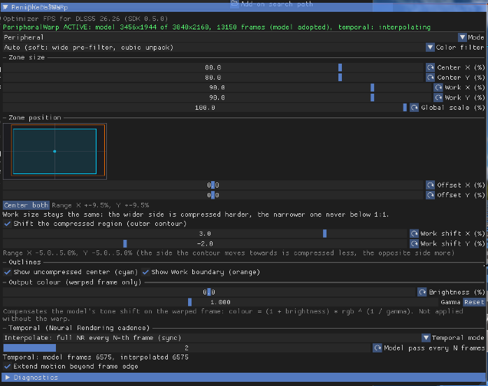
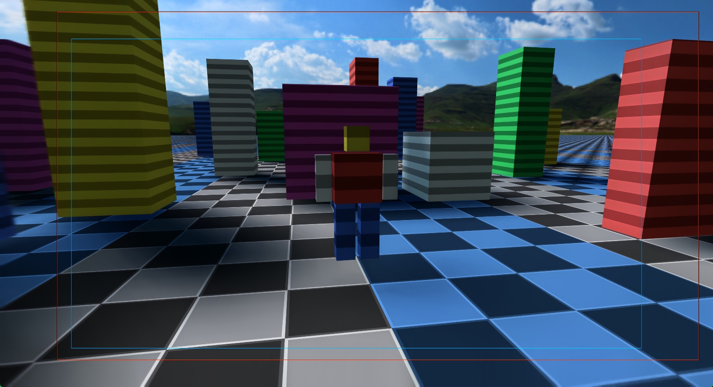

# Optimizer FPS for DLSS5

**Contents:** [What it does](#what-it-does) · [Install](docs/INSTALL.md) · [The NR consumer](#the-nr-consumer) · [Using the tab](#using-the-tab) · [Performance and quality](#performance-and-quality) · [Troubleshooting](#troubleshooting) · [How it works](#how-it-works) · [Building and the SDK](#building-and-the-sdk) · [Support](#support) · [License](#notices-and-license)

**Development notes, and a way to support the work if the add-on is useful to you:** 🤔😄🤗
[patreon.com/YGLabs](https://www.patreon.com/c/YGLabs).🤗

A ReShade add-on that reduces the GPU cost of DLSS 5 Neural Rendering. It compresses the screen
periphery before the model runs and, optionally, runs the model only every Nth frame, reprojecting
the frames in between along the game's motion vectors.

It needs a Neural Rendering setup that already works: renodx-dlss5, the DLSS5-Feeder host, or a
public OptiScaler build with Neural Rendering that loads ReShade. This release does not touch DLSS
Super Resolution.

**Requirements:** Windows 10/11 64-bit · NVIDIA RTX 20-series or newer · ReShade 6.8+ with full
add-on support · `nvngx_dlssnr.dll` 310.8 (the NR runtime) · a working NR consumer.

**[Download the latest release](https://github.com/BeliyG3/optimizer-fps-dlss5/releases/latest)** —
then follow **[docs/INSTALL.md](docs/INSTALL.md)**.

Unpack the zip and run `Install-OptimizerFPS.cmd "D:\Games\Example\game.exe"`.
It installs the x64 add-on, `optimizer-fps-dlss5-core.dll`, forwarder, and shader
folder together. For a 32-bit game, those x64 files go into the 64-bit Feeder
host; only `optimizer-fps-dlss5-remote.addon32` goes beside the game's ReShade.
Run `Verify-OptimizerFPS.ps1 -GameExe "D:\Games\Example\game.exe"` after install
and after a new game session. See the install guide for Update, Uninstall, and
`[ADDON] AddonPath`.

> **Anti-cheat:** the add-on hooks DLSS functions **inside the game process**. Do **not** use it in
> games with anti-cheat (EAC, BattlEye, Vanguard, Ricochet) or online multiplayer — you may get
> banned. Use at your own risk.

**Demo video:** [Optimizer FPS for DLSS5 in action (YouTube)](https://youtu.be/VZTYIaRnkpI)

*The two outlines the tab can draw: cyan is the 1:1 center — everything outside it is compressed
before the model and stretched back after it; orange marks the extent of the work frame the model
actually sees (Work 90 % here).*

## What it does

Two independent ways to cut the cost of Neural Rendering, each with its own switch in the add-on's
tab.

**Spatial.** The middle of the frame (80 % of each axis by default) stays at native 1:1 density.
The periphery is compressed non-linearly into a smaller work frame before the model runs and
unpacked afterwards. At 3840×2160 the model processes 81 % of the pixels (3456×1944 instead of
3840×2160), for roughly 0.3–0.5 ms of Pack/Unpack overhead.

**Temporal.** The model does not have to run on every frame.

| Mode | What happens | Frame times |
|---|---|---|
| Every frame | The model runs on every frame (spatial saving only). | as before |
| Interpolate | A full model pass every Nth frame (N = 2…8). The frames in between reuse the last pass's residual, reprojected along the game's own motion vectors, with depth and color acceptance tests, depth-matched hole fill, and Catmull-Rom resampling. | alternating long and short |
| Interpolate (background) | The model runs on its own GPU queue a few frames behind, on private copies of the inputs. Every displayed frame is a reprojection of the last finished pass. | more even (falls back to the synchronous mode when no host queue is available — for example when OptiScaler loads ReShade after the game's device exists) |

## The NR consumer

The add-on renders nothing by itself; it sits between an NR consumer and NVIDIA's runtime. One of
these must be installed and working first, by its own instructions:

* **renodx-dlss5**, part of [RenoDX](https://github.com/clshortfuse/renodx) — the usual case for a
  64-bit game.
* **[DLSS5-Feeder](https://github.com/jlrouzies-fr/DLSS5-Feeder)** — for 32-bit games. NR runs in its
  64-bit helper process, `<game>\host64\dlss5-feed-host64.exe`, and so does this add-on.
* **a public [OptiScaler](https://github.com/optiscaler/OptiScaler) build with Neural Rendering** —
  [Dagherbou/OptiScaler_DLSSNR](https://github.com/Dagherbou/OptiScaler_DLSSNR) (tested:
  `v0.2.0-patch1`) or
  [wilsjo2/OptiScaler-DLSSNR-PreSR-Multipass](https://github.com/wilsjo2/OptiScaler-DLSSNR-PreSR-Multipass)
  (tested: `v0.8.3`, `v0.8.91`). OptiScaler runs NR itself and loads ReShade: set
  `[Plugins] LoadReshade=true` in `OptiScaler.ini` and put ReShade 6.8+ with add-on support beside
  it as `ReShade64.dll`; the add-on then compresses OptiScaler's NR. Works for D3D12 games and for
  D3D11 games through OptiScaler's D3D11-on-D3D12 bridge, also with NR before the upscaler
  (wilsjo2 `RunBeforeSR`) and with OptiScaler's own frame generation. Use **one** compression: if
  your build has its own peripheral compression (wilsjo2 `SpatialCompression`), turn it off or set
  the add-on's **Mode** to `Off` — both together compress the frame twice.

## Using the tab

In the game, open the ReShade overlay (`Home`) → **Add-ons** → **Optimizer FPS for DLSS5**. The
first line is the status banner: green `Optimizer FPS ACTIVE: model WxH of WxH, N frames` or orange
`Optimizer FPS NOT ACTIVE: <reason>`. The banner reports **spatial** warping only: with **Mode** set
to `Off` it says NOT ACTIVE even while a temporal mode runs on the native model.

Below it are the spatial controls, the two outlines, "Output colour (warped frame only)", the
temporal cadence, and a Diagnostics tree. In a 32-bit game the same tab is drawn by
`optimizer-fps-dlss5-remote.addon32` beside the game's own ReShade; it drives the add-on running in
`host64` through shared memory. Current settings are saved to `ReShade.ini` under `[OptimizerFPS]`;
an existing `[PeripheralWarp]` section is copied once when no new section exists. The
full list of controls and keys is in [docs/RESHADE_ADDON.md](docs/RESHADE_ADDON.md).

## Performance and quality

The numbers below come from the project's own offline bench (procedural scene, 3840×2160, RTX 4080
SUPER, `nvngx_dlssnr.dll` 310.8), **not** from a game. Before/after captures from a real game will
follow with the first release.

| Bench run | Frame time | Frame rate |
|---|---:|---:|
| Every frame | 18.8 ms | 53 fps |
| Interpolate N=2 | 11.6 ms | 86 fps |
| Interpolate N=3 | 9.2 ms | 109 fps |
| Interpolate N=4 | 7.9 ms | 127 fps |

A full model pass costs 13–15 ms of that, so on the bench the frame time is almost entirely Neural
Rendering; the bench scene itself renders in about 3 ms. In a real game the model is a smaller share
of the frame, so the percentage gain is smaller than the table suggests, and the milliseconds saved
per model pass also shift with GPU load. These runs already have the spatial warp on at 80/90, so the
model processes 81 % of the pixels (3456×1944 instead of 3840×2160), at a cost of 0.3–0.5 ms for
Pack/Unpack. The bench and its measurement scripts are in [`tools/bench`](tools/bench)
(`run_modes.sh`, `errflick.py`; the run folder needs your own ReShade and NR consumer, see
`tools/bench/BASELINE.md`). Developed and tested on an RTX 4080 SUPER. DLSS 5 Neural Rendering itself
runs on RTX 20-series and newer, but the add-on has not been tested there. Your numbers will differ;
measure in your own game.

What it costs in image quality: interpolated frames ghost slightly on fast camera turns and around
disocclusions, small detail can shimmer at the pass frequency, and on a sudden lighting change the
tone lags by one frame. The model's own tonal response on a compressed frame is usually slightly
brighter; the Brightness and Gamma sliders compensate by eye, though because the host decodes the
model's output afterwards, the effect on the final picture is not 1:1 with the number. Start at
Peripheral 80/90 with Interpolate N=2 and go from there.

## Troubleshooting

See **[docs/TROUBLESHOOTING.md](docs/TROUBLESHOOTING.md)** for the tab saying NOT ACTIVE, the add-on
missing from the list, a 32-bit game showing no tab, wrong colors, Defender removing a file, and the
rest. One rule worth knowing up front: the crash guard writes `optimizer-fps-dlss5.session` beside the
add-on just before the first warped frame; a session that lived more than 20 s after that frame is
not counted as a crash. If the marker is still there at the next start, every NR call is forwarded
untouched until you press **Retry warping now** in the tab.

## How it works

The implementation has three parts. `sdk/` provides layout math and the public D3D11/D3D12
pixel adapters. `core/` builds `optimizer-fps-dlss5-core.dll` for the runtime and the static
`ofps_core` library (`OptimizerFps::Core`) for tests: `frame/`
records Pack → model → Unpack, `temporal/` carries model results, `flow/` owns the
process-lifetime temporal optical flow session, `gpu/` manages submissions
and fence-gated resource pools, `settings/` validates settings, and `shaders/` holds the
temporal and motion shaders. Its single host entry is `core/api/ofps_core.h` (ABI 1).

`hosts/reshade/` is the shell: Detours intercepts feature 18, `ngx_params` translates
the NGX block into explicit frame inputs, `ModelHostNgx` implements model calls, and
`ShellHost` connects core events to logging, settings persistence and the crash guard.
The shell consumes only the core's public ABI. Model and GPU resources retire behind
submission/background fences; without a queue, a 16-evaluate delay precedes a gate
retry, and resources remain pending until completion can be confirmed.
One pinned core DLL is shared per process; the shell loads it through the public ABI.
The runtime payload contains the x64 add-on, `optimizer-fps-dlss5-core.dll`,
`nvngx.dll_optimizerfps.dll`, and the built DXBC set in `optimizer-fps-dlss5/`
beside the core. The current build has 25 DXBC; the package manifest lists the
exact files.
The x86 remote overlay stays beside the 32-bit game; its core runs in `host64`.
The installer migrates older ReShade settings; the verifier checks the core.
The temporal machine, crash guard, direct-host ownership, and remote overlay are described in
[docs/RESHADE_ADDON.md](docs/RESHADE_ADDON.md), with per-file module maps in
[docs/dev/NGX_MODULES.md](docs/dev/NGX_MODULES.md) and
[docs/dev/ADDON_MODULES.md](docs/dev/ADDON_MODULES.md).

## Building and the SDK

Optimizer FPS for DLSS5 also ships its spatial building blocks as a standalone, API-neutral SDK
(`find_package(OptimizerFpsSdk 0.6)` → `OptimizerFps::SdkCore`): the layout math, the D3D11 and D3D12
adapters, and the HLSL sources, with no NGX and no ReShade in them. A consumer that applies the
warp itself integrates once per DLSS/NR loader, not once per game.

[docs/API.md](docs/API.md) (API and ABI) · [docs/CONFIG.md](docs/CONFIG.md) (configuration math) ·
[docs/INTEGRATION.md](docs/INTEGRATION.md), [docs/DLSSNR_COMMON_STAGE.md](docs/DLSSNR_COMMON_STAGE.md),
[docs/PORTING_CHECKLIST.md](docs/PORTING_CHECKLIST.md) (integration) ·
[BUILD.md](BUILD.md) (current build and bench commands) · [docs/BUILD.md](docs/BUILD.md) (build details) · [docs/CI.md](docs/CI.md) ·
[docs/RELEASING.md](docs/RELEASING.md) · [docs/LIMITATIONS.md](docs/LIMITATIONS.md) (known limits) ·
[CHANGELOG.md](CHANGELOG.md) (history).

The SDK lives in `sdk/`, with public headers under `sdk/include/optimizer_fps/`,
namespace `ofps::sdk` and CMake targets `OptimizerFps::SdkCore`, `OptimizerFps::SdkD3D11`
and `OptimizerFps::SdkD3D12`. SDK version 0.6.0 installs headers to `include/optimizer_fps/`,
adapter headers below `include/optimizer_fps/adapters/`, and shader sources to
`share/optimizer-fps-sdk/shaders/`. Consumers use `find_package(OptimizerFpsSdk 0.6 CONFIG REQUIRED)`.
`OptimizerFps::Core` is a separate Windows x64 build-tree target, not an installed SDK target.
Compatibility exports retain their `PeripheralWarp*` names. The two version numbers,
and why the name exported to ReShade carries none, are explained in
[docs/RESHADE_ADDON.md](docs/RESHADE_ADDON.md).

## Support

Bugs: open a GitHub Issue and attach `ReShade.log` and the output of
`Verify-OptimizerFPS.ps1 -Json`. To disable the add-on, uncheck it in ReShade's **Add-ons** tab (or
remove the files) and **restart the game**; the hooks stay in place until the process exits.

## Notices and license

This project is **not affiliated with NVIDIA, ReShade, or RenoDX**. DLSS, NGX, and GeForce are
trademarks of NVIDIA Corporation. Optimizer FPS for DLSS5 itself is [MIT](LICENSE), provided as is with no
warranty. NVIDIA runtimes and the ReShade/RenoDX applications are not bundled; the ReShade add-on API
headers (BSD-3) and Dear ImGui / Microsoft Detours (MIT) are used under their licenses. All
build-time third-party components are listed in [NOTICE](NOTICE),
[`DEPENDENCIES.lock.json`](DEPENDENCIES.lock.json) and
[`third_party/licenses`](third_party/licenses).

NVIDIA NGX, DLSS, `nvngx_dlssnr.dll`, RenoDX, DLSS5-Feeder, and OptiScaler are **not** included and
are not covered by this license. Install each of them from its own source.
