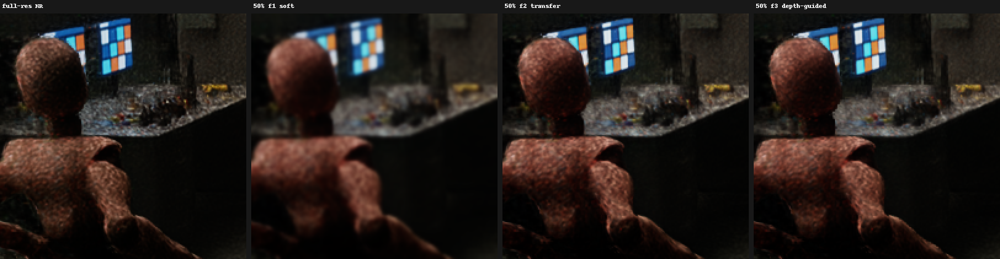
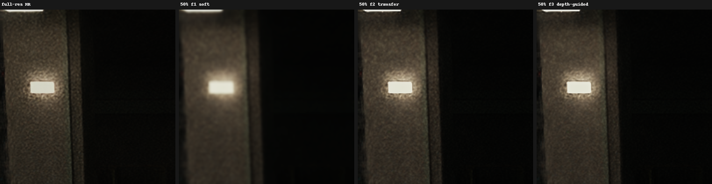

# Detail transfer on bench12: does it pay off?

Plan 2026-09-27, task 5 (2026-09-27, branch `feature/detail-transfer`, core at `c7ab5d2`).
`ColorFilter=2` (detail transfer) and `3` (depth-guided detail transfer) rebuild the shrunk
parts of the frame as the full-size frame plus the model's upscaled edit, instead of stretching
the model's picture (`ColorFilter=1`, soft). This page measures what that costs and what it
gives back, against full-resolution NR on the same frames.

## Setup

- **Stand:** bench12 `run_nrhost` (native D3D12, path tracing, DLSS SR 960×540 → 1920×1080,
  the NR model at native 1920×1080 through the add-on's NGX host), lab scene, 520 frames,
  frames 240 and 479 dumped. Add-on and core from `out/build/x64` at `c7ab5d2`.
- **Cases** (opt-in in `tools/bench12/reference_dumps.ps1`; they run only when named with
  `-Case`, never in the release gate): `off_t0_time` (model at full resolution, the reference),
  `uniNN_fK` (`Mode=1`, uniform shrink to `WorkX=WorkY=NN` %, `ColorFilter=K`), `per_fK`
  (`Mode=2`, the default peripheral warp: centre 80 %, periphery 90 %), plus smoke cases
  (`_cl` model on a COMPUTE list, `_t1` frame carry mode 1, `_stdz` standard Z, `_dbg` D3D12
  debug layer, `_r10` R10G10B10A2 colour proxy). Timed cases set `DebugTiming=1`.
- **Metrics** (`tools/bench12/compare_transfer.py`, mean of the two frames):
  - `post ms` — bench GPU frame time minus path tracing: everything after the render (SR, NR,
    our passes). The cost users feel. One run of 520 frames per case in the main table; the
    cases the verdict rests on were run three times (see "Timing over three runs").
  - `model ms` — the model's evaluate alone (`DebugTiming`, last logged average of 480
    samples); `nan` where timing was off.
  - `PSNR dB` — against `off_t0_time`, RGB8.
  - `detail` — mean absolute Laplacian relative to `off_t0_time` (1.0 = as sharp).
  - `silh err` — mean colour error (RGB8 levels) within 2 px of a depth step (a 5×5 square
    around every step pixel, bounded at the image edges). The mask comes from the `depthview`
    case (`--view depth`). bench12's depth view spans only 13 of 256 levels (240..253) and one
    level is floor banding, so a silhouette is a step of at least 2 levels between neighbours
    (`--depth-step 2`); the plan's "gradient above 8/255" gave an empty mask on this stand. The
    mask covers 1.14 % of frame 240 (the figure, the tables, a lamp) and 0.16 % of frame 479.

Commands (PowerShell, repository root):

```powershell
cmd.exe /c 'call "C:\Program Files\Microsoft Visual Studio\2022\Community\VC\Auxiliary\Build\vcvars64.bat" >nul 2>&1 && cmake --build --preset windows-x64-release'
powershell -NoProfile -ExecutionPolicy Bypass -File tools\bench12\reference_dumps.ps1 -Runtime run_nrhost -Out "$env:TEMP\ofps-transfer\run" -Frames 520 -DumpFrames 240,479 -Case depthview,off_t0_time,uni50_f1,uni50_f2,uni50_f3,uni70_f1,uni70_f3,uni85_f1,uni85_f3,per_f1,per_f3,uni50_f3_cl,uni50_f3_t1,uni50_f3_stdz,uni50_f3_dbg,per_f1_r10,per_f3_r10
python tools\bench12\compare_transfer.py "$env:TEMP\ofps-transfer\run" --frames 240,479
```

## Results: bench12 NR host

```
case              post ms  model ms  PSNR dB  detail  silh err
off_t0_time         11.42      4.96      ref   1.000         -
uni50_f1             9.28      2.75    33.53   0.177      5.00
uni50_f2             9.31      2.75    34.93   0.899      3.59
uni50_f3             9.36      2.76    34.91   0.896      3.62
uni70_f1             9.87      3.32    36.69   0.283      3.47
uni70_f3             9.98      3.27    38.57   0.904      2.34
uni85_f1            10.79      4.21    40.15   0.428      2.27
uni85_f3            10.67      4.12    42.05   0.917      1.50
per_f1              11.03      4.36    38.66   0.755      2.55
per_f3              11.14      4.41    40.07   0.973      2.42
uni50_f3_cl          9.73       nan    34.91   0.896      3.62
uni50_f3_t1          8.62       nan    35.01   0.916      4.67
per_f1_r10          10.90       nan    38.53   0.758      2.70
per_f3_r10          10.83       nan    39.91   0.977      2.58
```

All 17 cases finished with `device ok` and exit 0; every warp case (all but `depthview` and
`off_t0_time`, which run `Mode=0`) logged `first warped evaluate completed` and
`compute path ready`; no `DEVICE_REMOVED`, no
`detail transfer off` and no `needs the compute path` line. `uni50_f3_dbg` (debug layer): no
errors or corruption messages; 9 severity-2 warnings, all "CreateCommittedResource: Ignoring
InitialState ... Buffers are effectively created in state COMMON" (buffers created in
COPY_DEST/UNORDERED_ACCESS). `uni50_f3_t1` logged `temporal machine ready`.

Side results:

- `uni50_f3_cl` and `uni50_f3_stdz` are byte-identical to `uni50_f3` on both frames. The COMPUTE
  list costs +0.37 ms `post ms` on this stand (queue hand-over), not pixels. bench12's default
  depth is already standard Z (`depth inverted 0` in both logs), so `_stdz` repeats `uni50_f3`
  and shows only that the run is deterministic; reversed Z was not exercised here.
- `_r10` differs from the RGBA16F proxy by 0.12–0.32 levels on average (the R10 proxy's
  quantisation); `detail` and the f1/f3 ordering are the same.
- Frame carry mode 1 (`uni50_f3_t1`) is the cheapest (8.62 ms, −24.5 %) but has the worst
  silhouettes of the 50 % cases (4.67).

## Timing over three runs

`off_t0_time`, `uni50_f1`, `uni50_f3`, `per_f1` and `per_f3` were captured two more times
(fresh `-Out` folders `run2`, `run3`, same `-Frames 520 -DumpFrames 240,479`) and measured with
`compare_transfer.py ... --depth-case= --cases uni50_f1 uni50_f3 per_f1 per_f3`. The frames are
byte-for-byte the same in all three runs (identical PSNR and detail); only the timing moves.

| case | post ms run 1 / 2 / 3 | post ms mean (min–max) | model ms mean (min–max) | post ms drop vs `off_t0_time`, mean (per run) |
|---|---|---|---|---|
| off_t0_time | 11.42 / 10.57 / 10.38 | 10.79 (10.38–11.42) | 4.69 (4.51–4.96) | — |
| uni50_f1 | 9.28 / 8.64 / 8.67 | 8.86 (8.64–9.28) | 2.64 (2.56–2.75) | −17.9 % (−18.7 / −18.3 / −16.5 %) |
| uni50_f3 | 9.36 / 8.70 / 8.77 | 8.94 (8.70–9.36) | 2.64 (2.56–2.76) | −17.1 % (−18.0 / −17.7 / −15.5 %) |
| per_f1 | 11.03 / 9.92 / 10.19 | 10.38 (9.92–11.03) | 4.12 (3.92–4.36) | −3.8 % (−3.4 / −6.1 / −1.8 %) |
| per_f3 | 11.14 / 9.91 / 10.03 | 10.36 (9.91–11.14) | 4.10 (3.90–4.41) | −4.0 % (−2.5 / −6.2 / −3.4 %) |

What the repeats say about noise:

- **Between runs the whole stand drifts by up to ~10 %.** Run 1 was slower in every case
  (off_t0_time 11.42 against 10.38–10.57 ms; the model itself 4.96 against 4.51–4.58 ms), so
  single-run absolute numbers from different sessions are not comparable to a few percent.
- **Pairing gives a consistent comparison at 50 %.** f3 minus f1 at 50 %: +0.08 / +0.06 / +0.10 ms,
  the same sign every time (+0.7 to +1.1 %, the transfer's extra work), while the peripheral f3 − f1
  difference still varies: +0.11 / −0.01 / −0.16 ms (−0.16 to +0.11 ms), inside the noise.
- The single-run percentages in the main table and in "Verdict per scale" (uniform 70 % and 85 %
  were run once) carry this uncertainty; none of them is within 5 points of −25 %, so the
  spread does not change the verdict.

## Regression of the old cases

The capture and compare steps of the local release gate (`out/plan8-gate/gate_capture.ps1`:
`capture-{pixel,compute}-{run_addon,run_r521,run_nrhost,core}`, `compare-pixel`,
`compare-compute`, fresh `plan8_*` folders) on the same build: **GATE PASS**. `compare-pixel`:
64 of 64 frames byte-identical to `reference_before_2026.9.1` (run_addon 14, run_r521 18,
run_nrhost 32 pairs, maximum MAD 0.0). `compare-compute`: pass, maximum MAD 0.30 / 0.20 / 0.29,
core 0.0. The run_nrhost manifests list only the gate's cases; none of the opt-in transfer cases
ran.

## Crops (frame 240, 2× nearest)

Silhouette (the figure against the table) — full-resolution NR, 50 % soft, 50 % transfer,
50 % depth-guided transfer:



Textured wall (the lit pillar):



The soft filter blurs the model's texture away; both transfer filters keep the full-size
frame's grain and edges. f2 and f3 are hard to tell apart by eye; neither shows a visible halo
around the figure at this size.

## Verdict per scale

Rule: a scale is worth it when `post ms` drops by ≥ 25 % against `off_t0_time`, `detail ≥ 0.95`,
and `silh err` of f3 ≤ that of f1. Uniform 50 % and peripheral use the means of three runs
(reference 10.79 ms post, 4.69 ms model); uniform 70 % and 85 % are single runs against run 1
(11.42 / 4.96 ms).

| Scale | post ms f3 (drop) | model ms f3 (drop) | detail f3 | silh f3 ≤ f1 | Worth it |
|---|---|---|---|---|---|
| uniform 50 % (3 runs) | 8.94 (−17.1 %, runs −15.5..−18.0 %) | 2.64 (−44 %) | 0.896 | 3.62 ≤ 5.00 yes | **no** — cost and detail short |
| uniform 70 % (1 run) | 9.98 (−12.6 %) | 3.27 (−34 %) | 0.904 | 2.34 ≤ 3.47 yes | **no** — cost and detail short |
| uniform 85 % (1 run) | 10.67 (−6.6 %) | 4.12 (−17 %) | 0.917 | 1.50 ≤ 2.27 yes | **no** — cost and detail short |
| peripheral, Mode 2 (3 runs) | 10.36 (−4.0 %, runs −2.5..−6.2 %) | 4.09 (−13 %) | 0.973 | 2.42 ≤ 2.55 yes | **no** — cost short |

No scale passes the rule on bench12. What the numbers say:

- **The transfer itself is nearly free and clearly better than soft.** f3 against f1 at the
  same scale: `post ms` +0.06 to +0.10 ms at 50 % in each of three runs (+0.7 to +1.1 %),
  within noise in peripheral mode and in the single 70 % / 85 % runs, `detail`
  0.18 → 0.90 at 50 %, 0.28 → 0.90 at 70 %, 0.43 → 0.92 at 85 %, 0.76 → 0.97 peripheral; PSNR
  +1.4 to +1.9 dB; silhouette error lower at every scale. As a replacement for the soft
  filter, it pays off everywhere.
- **The frame-time rule fails for a reason outside the filter.** Of the 10.79 ms after the
  render (mean of three runs), only 4.69 ms is the model; SR and the rest of NR's work (about
  6.1 ms) do not shrink. A 25 % drop means ≤ 8.09 ms, so the model plus our passes may take at
  most about 2.0 ms; at 50 % they take about 2.8 ms (model 2.64 ms). On this
  stand (1080p, a model that costs ~5 ms) no uniform scale down to 50 % reaches −25 %. Where
  the model is a larger share of the post chain (higher output resolution, a lighter chain) the
  same scales may clear it; that is not measured here.
- **Detail stops at ~0.90–0.92 in uniform modes.** The transfer restores the full-size frame's
  high frequencies but the model's own synthesised detail is still made at the reduced size.
  Only the peripheral mode, which keeps the centre near full size, clears 0.95.
- **Depth guidance buys nothing measurable here.** f3 and f2 at 50 %: `silh err` 3.62 against
  3.59, PSNR 34.91 against 34.93; the two differ by 0.26 / 0.10 levels on average over the
  frame and 0.96 / 0.22 within the silhouette band (frames 240 / 479); f3's wider tent (4×4 texels against f2's bilinear 2×2) costs it a little
  detail (0.896 against 0.899). With `OFPS_TRANSFER_DEPTH_TOLERANCE` 0.05 (a texel 5 % off in
  depth counts half) the depth weight rarely bites on this scene; the next thing to try is 0.03
  (stricter), and 0.08 only if 0.03 starts to leave the frame's own, un-edited rims visible.
  Tuning is a follow-up.

## Behind a public OptiScaler (task 5b)

The same core inside the public OptiScaler (Dagherbou `v0.2.0-patch1` build,
`OptiScaler.dll` SHA-256 `6169213E…CB0A`, its own NR, ReShade loaded by OptiScaler) on bench12
with DLSS RR, 240 frames, frames 120 and 239. Add-on cases run `Mode=2` (peripheral warp) on
the compute path with `DebugTiming=1`; `compute_t0` keeps the stand's `ColorFilter=1`.
`model50_*` set OptiScaler's `[DlssNr] WorkingScale=0.5`: the core then works on OptiScaler's
960×540 model grid (our model 864×486) and is judged against `model50_control`, which includes
OptiScaler's own reduction — the transfer can only restore what our compression lost on that
grid, not what OptiScaler's reduction lost (that is OptiScaler's own resolve). No depth view on
this stand, so no silhouette column.

```powershell
python tools\bench12\check_plan8_public_optiscaler.py --optiscaler <public OptiScaler>\OptiScaler.dll --output-root "$env:TEMP\ofps-transfer\opti" --cases control compute_t0 compute_t0_f3 model50_control model50_compute_f1 model50_compute_f3
python tools\bench12\compare_transfer.py "$env:TEMP\ofps-transfer\opti\public_optiscaler" --flat --depth-case= --reference control --cases compute_t0 compute_t0_f3
python tools\bench12\compare_transfer.py "$env:TEMP\ofps-transfer\opti\public_optiscaler" --flat --depth-case= --reference model50_control --cases model50_compute_f1 model50_compute_f3
```

(`--depth-case=`: Windows PowerShell 5.1 drops an empty `""` argument to a native program.)

```
case              post ms  model ms  PSNR dB  detail  silh err
control             12.09       nan      ref   1.000         -
compute_t0          11.55      4.23    36.56   0.858       nan
compute_t0_f3       11.78      4.39    37.03   0.981       nan
case              post ms  model ms  PSNR dB  detail  silh err
model50_control      9.59       nan      ref   1.000         -
model50_compute_f1     9.95      2.71    35.73   0.963       nan
model50_compute_f3    10.21      2.87    36.13   1.001       nan
```

Script result PASS: every add-on case adopted OptiScaler's feature 18, logged
`first warped evaluate completed` and `compute path ready`, state sentinel PASS, no device
removal, exception or crash guard. The expectation holds: f3 has higher `detail` and PSNR than
f1 in both pairs (0.858 → 0.981 and +0.47 dB at native; 0.963 → 1.001 and +0.40 dB on the 50 %
grid), at `post ms` +2.0 % and +2.6 %. These are single runs, so the ±3 % criterion is met
nominally but not shown to be a real cost: the model's own time moved by as much between the
paired runs (4.23 → 4.39, 2.71 → 2.87 ms) although the filter does not touch the model, and the
three-run bench12 repeats above show whole-run drift of up to ~10 %, against a paired f3 − f1
cost of only +0.7 to +1.1 % inside one session. The OptiScaler cases were not repeated.

On OptiScaler's 50 % grid, those single runs measured `model50_compute_*` 0.36–0.62 ms slower than
`model50_control`; repeats are needed to establish the overhead. The model there is already small
(960×540 → 864×486 after our warp), so the warp's fixed passes may outweigh the model time it
removes if the gap holds up.

The plan-8 script used to lose the measured run's `ReShade.log` and `OptiScaler.log`: the state
sentinel run in the same folder restarts both and rewrites them. It now keeps the measured run's
logs under their usual names and the sentinel's as `sentinel_*.log` (bad markers are still
searched in both), so the `warped`/`hooked` checks and `model time` come from the 240-frame run.

## Behind Ray Reconstruction (2026-09-27, core at `34c8db3`)

The same cases with DLSS RR instead of SR in front of the model (`rr_*` cases in
`reference_dumps.ps1`, opt-in; `--upscaler rr --nr native`). `rr_nonr` is RR alone, without the
model. Reference: `rr_off_t0_time`; the silhouette mask comes from `rr_depthview`.

```powershell
powershell -NoProfile -ExecutionPolicy Bypass -File tools\bench12\reference_dumps.ps1 -Runtime run_nrhost -Out "$env:TEMP\ofps-rr\run1" -Frames 520 -DumpFrames 240,479 -Case rr_nonr,rr_depthview,rr_off_t0_time,rr_uni50_f1,rr_uni50_f2,rr_uni50_f3,rr_uni70_f1,rr_uni70_f3,rr_uni85_f1,rr_uni85_f3,rr_per_f1,rr_per_f3
python tools\bench12\compare_transfer.py "$env:TEMP\ofps-rr\run1" --frames 240,479 --reference rr_off_t0_time --depth-case rr_depthview --cases rr_nonr rr_uni50_f1 rr_uni50_f2 rr_uni50_f3 rr_uni70_f1 rr_uni70_f3 rr_uni85_f1 rr_uni85_f3 rr_per_f1 rr_per_f3
```

```
case              post ms  model ms  PSNR dB  detail  silh err
rr_off_t0_time      10.96      4.60      ref   1.000         -
rr_nonr              6.30       nan    28.53   0.770      6.87
rr_uni50_f1          9.01      2.55    32.75   0.270      5.68
rr_uni50_f2          8.97      2.52    33.52   0.838      4.48
rr_uni50_f3          9.35      2.61    33.50   0.833      4.44
rr_uni70_f1          9.51      3.01    37.07   0.366      3.76
rr_uni70_f3          9.49      2.99    38.37   0.836      2.58
rr_uni85_f1         10.35      3.87    40.22   0.496      2.89
rr_uni85_f3         10.34      3.83    41.38   0.848      2.08
rr_per_f1           10.49      3.96    37.20   0.759      2.20
rr_per_f3           10.42      3.93    37.60   0.912      2.03
```

Post ms over three runs (mean, range), whole GPU frame in brackets:

```
rr_nonr           6.34 (6.30-6.39)   [10.00]
rr_off_t0_time   10.94 (10.87-11.01) [14.56]
rr_uni50_f1       9.03 (8.99-9.09)   [12.67]  -17.5 %
rr_uni50_f3       9.19 (9.09-9.35)   [12.84]  -16.0 %
rr_uni70_f3       9.57 (9.49-9.70)   [13.21]  -12.5 %
rr_per_f1        10.46 (10.37-10.52) [14.09]   -4.4 %
rr_per_f3        10.45 (10.41-10.53) [14.10]   -4.5 %
off_t0_time (SR) 10.59 (10.51-10.67) [14.25]
uni50_f3 (SR)     8.69 (8.60-8.75)   [12.31]  -18.0 %
per_f3 (SR)      10.11 (9.96-10.28)  [13.75]   -4.6 %
```

The savings match SR's: the model's share drops from 4.6 ms to 2.9 ms at 50 %. Transfer costs
about 0.15 ms over the soft filter at 50 % and nothing measurable in Peripheral. Detail behind
RR comes back to 0.83-0.85 (SR: 0.90) and 0.91 in Peripheral (SR: 0.97), likely because RR's
output is already softer than full-size NR (0.77 on its own); not verified further.
